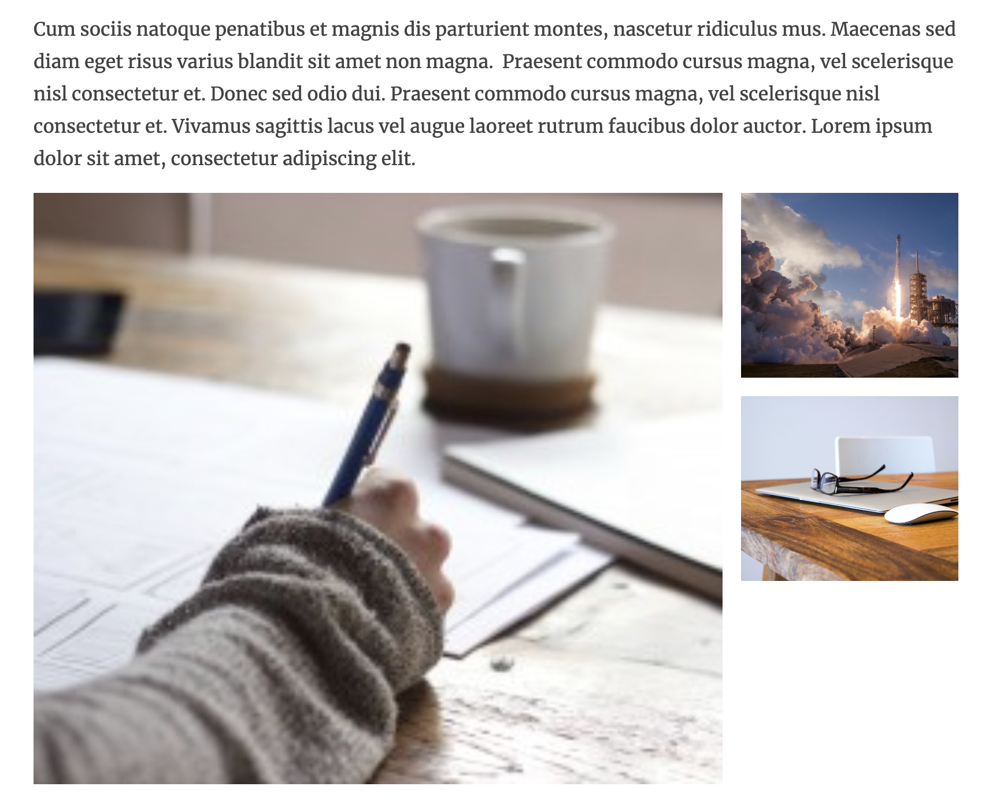

# 🖼️ UpAssist NodeTypes Gallery

Introduces a gallery nodetype to create a grid based gallery of images.

## 🔧 Implementation
- Require the package in your site package
- Install it using composer
- Make sure you load the css and js file (see the fusion files for examples)
- Make sure you add the `data-gallery-span=".."` to your image content object (see the fusion files for example)

## ✅ Todo
- Implement lightbox / modal
- Better documentation
- Better implementation guide
